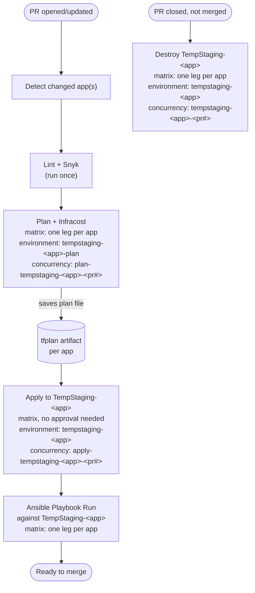
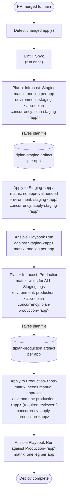
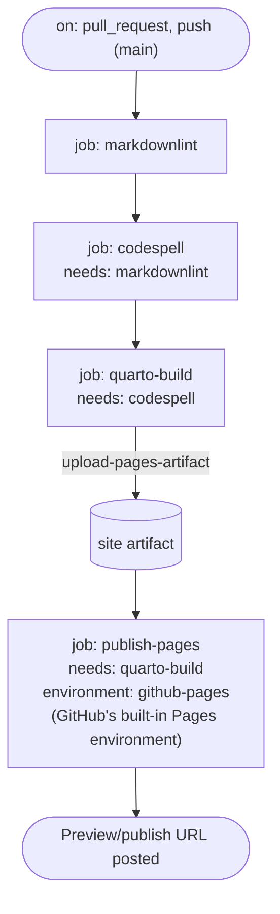
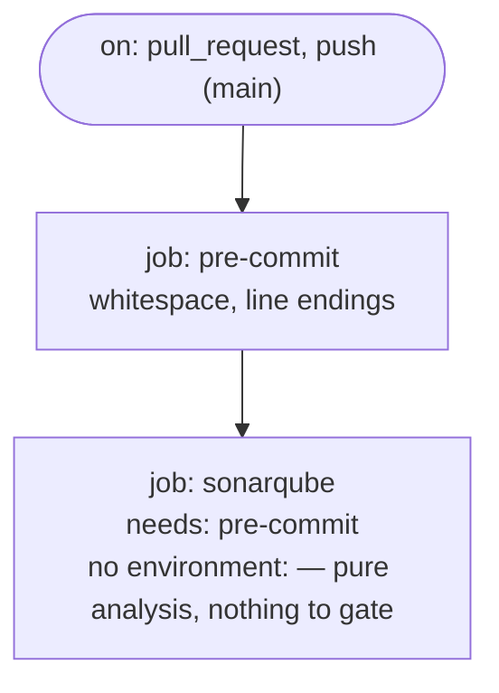

# CI/CD Pipeline Documentation

This document describes the CI/CD pipeline for this repository's Terraform infrastructure: how a change moves from a developer's machine to production, what checks gate it along the way, and what triggers each stage.

## Workflow files

There is no orchestrating "caller" file — each workflow below has its own direct trigger and runs independently. GitHub's branch-protection required-status-checks are what actually stitch them into a merge gate, not one workflow calling another.

| File | Trigger | Contains |
| --- | --- | --- |
| `infrastructure-pr.yml` | `pull_request`: opened/synchronize/reopened → runs the plan/apply chain. `pull_request`: closed (and not merged) → destroys TempStaging | Lint (`tflint`, `ansible-lint`, run once) → Snyk (once) → **matrix** of Terraform plan + Infracost → Terraform apply, one leg per changed app, against **TempStaging** → Ansible playbook run against the applied TempStaging-\<app\> |
| `infrastructure-main.yml` | `push` to `main` (fires right after a PR merges) | Lint/Snyk (once) → **matrix** of Terraform plan + Infracost → Terraform apply to **Staging** (one leg per app) → Ansible playbook run against Staging-\<app\>, then, once every Staging leg has applied, **matrix** of Terraform plan + Infracost → Terraform apply to **Production** → Ansible playbook run against Production-\<app\> |
| `documentation.yml` | `pull_request` and `push` to `main` | Lint (Markdownlint) → Spell check (Codespell) → Compile (Quarto build) → Preview/publish to GitHub Pages |
| `quality.yml` | `pull_request` and `push` to `main` | Pre-commit (whitespace, line endings) → SonarQube static analysis |

`infrastructure-pr.yml` and `infrastructure-main.yml` are two separate files rather than one shared `infrastructure.yml`, because the PR-side and merge-side chains genuinely differ in shape: `infrastructure-pr.yml` is a single plan/apply pair per app against one throwaway environment each, while `infrastructure-main.yml` is a two-stage staging-then-production promotion per app with a manual approval gate on the second stage. Each also starts with a `detect-environments` job that derives which app(s) actually changed from the diff — the matrix's value list, not a hardcoded set of app names — so `lint`/`snyk` run once per workflow invocation while everything downstream fans out per changed app.

## Environments

Each app gets its own copy of all three environments, so with `N` apps there are `3N` environments in play, not 3:

| Environment | Created by | Purpose | Lifecycle |
| --- | --- | --- | --- |
| **TempStaging** (`tempstaging-<app>`) | `infrastructure-pr.yml`, one matrix leg per changed app | A per-PR, per-app ephemeral environment for feature testing | Created on PR open/update; destroyed only if the PR is closed **without** merging — a merged PR's TempStaging is left as-is |
| **Staging** (`staging-<app>`) | `infrastructure-main.yml`, one matrix leg per app | Shared pre-production environment used by the QA team for testing | Long-lived; re-applied on every merge to `main` that touches that app |
| **Production** (`production-<app>`) | `infrastructure-main.yml`, one matrix leg per app | The live environment | Long-lived; only reached after that same app's Staging leg has applied successfully |

## Pipeline overview

```mermaid
flowchart TD
    A[Developer] --> B[Push Branch / Open PR]
    B --> T(["pull_request:<br/>opened, synchronize, reopened"])

    T --> INF1CALL["infrastructure-pr.yml"]
    T --> DOC1CALL["documentation.yml"]
    T --> QUA1CALL["quality.yml"]

    subgraph INF1[" infrastructure-pr.yml "]
        INF1CALL --> INF1DET{{"detect-environments:<br/>which app(s) changed?"}}
        INF1DET --> INF1L["Lint<br/>tflint, ansible-lint<br/>(runs once)"]
        INF1L --> INF1S["Snyk<br/>(runs once)"]
        INF1S --> INF1P["Terraform Plan<br/>TempStaging + Infracost<br/>matrix: one leg per changed app"]
        INF1P --> INF1A["Terraform Apply<br/>TempStaging-&lt;app&gt;<br/>matrix: one leg per changed app<br/>(destroyed if PR is closed without merging)"]
        INF1A --> INF1AN["Ansible Playbook Run<br/>against TempStaging-&lt;app&gt;<br/>matrix: one leg per changed app"]
    end

    subgraph DOC1[" documentation.yml "]
        DOC1CALL --> DOC1L["Lint<br/>Markdownlint"]
        DOC1L --> DOC1S["Spell check<br/>Codespell"]
        DOC1S --> DOC1C["Compile<br/>Quarto build"]
        DOC1C --> DOC1G["Preview/publish<br/>GitHub Pages"]
    end

    subgraph QUA1[" quality.yml "]
        QUA1CALL --> QUA1P["Pre-commit<br/>whitespace, line endings"]
        QUA1P --> QUA1SQ["SonarQube<br/>static analysis"]
    end

    INF1AN --> M["PR Approve and Merge<br/>to Main Branch"]
    DOC1G --> M
    QUA1SQ --> M

    M --> N(["push:<br/>main"])

    N --> INF2CALL["infrastructure-main.yml"]
    N --> DOC2CALL["documentation.yml"]
    N --> QUA2CALL["quality.yml"]

    subgraph DOC2[" documentation.yml "]
        DOC2CALL --> DOC2L["Lint<br/>Markdownlint"]
        DOC2L --> DOC2S["Spell check<br/>Codespell"]
        DOC2S --> DOC2C["Compile<br/>Quarto build"]
        DOC2C --> DOC2G["Preview/publish<br/>GitHub Pages"]
    end

    subgraph QUA2[" quality.yml "]
        QUA2CALL --> QUA2P["Pre-commit<br/>whitespace, line endings"]
        QUA2P --> QUA2SQ["SonarQube<br/>static analysis"]
    end

    subgraph INF2[" infrastructure-main.yml "]
        INF2CALL --> INF2DET{{"detect-environments:<br/>which app(s) changed?"}}
        INF2DET --> INF2L["Lint<br/>tflint, ansible-lint<br/>(runs once)"]
        INF2L --> INF2S["Snyk<br/>(runs once)"]
        INF2S --> INF2P1["Terraform Plan<br/>Staging + Infracost<br/>matrix: one leg per app"]
        INF2P1 --> INF2A1["Terraform Apply<br/>Staging-&lt;app&gt;<br/>matrix: one leg per app<br/>(used by QA team for testing)"]
        INF2A1 --> INF2AN1["Ansible Playbook Run<br/>against Staging-&lt;app&gt;<br/>matrix: one leg per app"]
        INF2AN1 --> INF2P2["Terraform Plan<br/>Production + Infracost<br/>matrix: one leg per app<br/>(waits for ALL Staging legs)"]
        INF2P2 --> INF2A2["Terraform Apply<br/>Production-&lt;app&gt;<br/>matrix: one leg per app"]
        INF2A2 --> INF2AN2["Ansible Playbook Run<br/>against Production-&lt;app&gt;<br/>matrix: one leg per app"]
    end

    INF2AN2 --> Z(("Deploy Completed"))
    DOC2G --> Z
    QUA2SQ --> Z
```

## Detailed workflow diagrams

Each file below is drawn on its own so the job-level mechanics — `needs`, `environment:`, `concurrency:` groups, and artifact hand-off — are visible per file, instead of collapsed into the single overview above.

### `infrastructure-pr.yml`

Triggered directly by `pull_request` — no wrapper file calls it. `lint`/`snyk` run once; `terraform-plan`/`infracost`/`terraform-apply`/**Ansible playbook run** (and the teardown job) run as a **matrix** — one leg per app/environment that actually changed in the PR, so a PR touching multiple apps gets one TempStaging per app instead of one shared environment. Every plan and apply job still needs `environment:` set, just to assume the right OIDC role and read the right backend/secrets — but the plan job points at a separate `<env>-plan` environment with **no** required reviewers, while only the apply job points at the real `<env>` environment that actually carries the approval rule. That split is what lets plan get credentials without also getting gated by an approval it's supposed to inform. Once a leg's Terraform apply succeeds, that same leg runs the Ansible playbook against the just-applied TempStaging-\<app\>, so the environment isn't considered ready until it's both provisioned and configured. Each matrix leg's plan and apply jobs also carry their own `concurrency` group, keyed by app **and** PR number, so two pushes to the same PR (or two different PRs touching the same app) never plan/apply that app's TempStaging at the same time — the later run queues instead of racing.

### `infrastructure-main.yml`

Triggered directly by `push` to `main`, right after a PR merges. `lint`/`snyk` run once; every plan/apply/**Ansible playbook run** job is a **matrix** over the apps that changed, and Staging must fully apply *and* run its Ansible playbook — every matrix leg of `terraform-apply-staging` followed by its Ansible step — before the Production plan job even starts, since a job-level `needs:` waits for the whole upstream job, not per matrix leg. As with `infrastructure-pr.yml`, every plan job still declares `environment:` (to assume its role and reach its backend/secrets) but points at an unprotected `<env>-plan` environment, while only the apply job points at the real `staging-<app>`/`production-<app>` environment that carries the (production-only) required-reviewers rule. Once a leg's Terraform apply succeeds, that same leg runs the Ansible playbook against the environment it just applied to (Staging or Production), so promotion to the next stage only happens after both provisioning and configuration have finished. Each matrix leg's plan and apply jobs also carry their own `concurrency` group, keyed by app (and by stage — plan vs apply, staging vs production), so two merges landing close together never touch the same app's state at the same time — the later run queues instead of racing.

### `documentation.yml`

Triggered directly by both `pull_request` and `push` to `main` — the same jobs run either way.

### `quality.yml`

Triggered directly by both `pull_request` and `push` to `main`.

## Stage details

### 1. Development

A developer writes code locally, commits, and pushes a feature branch, then opens a pull request against `main`. Opening (or updating) the PR triggers `infrastructure-pr.yml`, `documentation.yml`, and `quality.yml` — each independently, on the same `pull_request` event.

### 2. Feature branch CI

There is no ordering dependency between `infrastructure-pr.yml`, `documentation.yml`, and `quality.yml`; a failure in one does not block the others from running, but the PR cannot merge until all three succeed (enforced by required-status-checks on `main`, not by one workflow waiting on another).

- **`infrastructure-pr.yml`**: a `detect-environments` job first derives which app(s) the PR actually touches from the diff (the same pattern as any path-based change detection — no hardcoded app list); `lint`/`snyk` then run once, and Terraform plan/Infracost/apply run as a matrix, one leg per changed app, each against its own **TempStaging-\<app\>** environment. TempStaging is provisioned per PR *and per app* so a reviewer (or the author) can exercise the actual feature against real infrastructure; each app's TempStaging is destroyed automatically only if the PR is closed **without** merging, so no leftover infrastructure lingers from an abandoned feature branch. Once a matrix leg's apply succeeds, that same leg runs the Ansible playbook against the just-applied TempStaging-\<app\> to configure it, before the leg is considered done.
- **`documentation.yml`**: Markdownlint → Codespell → Quarto build → preview/publish to GitHub Pages, so documentation changes get the same build-and-preview treatment as infrastructure changes.
- **`quality.yml`**: pre-commit checks (trailing whitespace, line endings) → SonarQube static analysis.

### 3. Merge gate

The PR can be approved and merged to `main` once `infrastructure-pr.yml`, `documentation.yml`, and `quality.yml` have all completed successfully against the feature branch.

### 4. Post-merge CI/CD

Merging to `main` produces a `push` event on `main`, which independently triggers `infrastructure-main.yml`, `documentation.yml`, and `quality.yml` again — this time against `main` itself:

- **`documentation.yml`** and **`quality.yml`** re-run their checks against the merged commit, unchanged from the PR run.
- **`infrastructure-main.yml`** derives the changed app(s) the same way, runs `lint`/`snyk` once, then matrixes Terraform plan (Staging) + Infracost → Terraform apply to **Staging-\<app\>** (the environment the QA team uses for testing) one leg per app — followed by a second matrix, Terraform plan (Production) + Infracost → Terraform apply to **Production-\<app\>**, which only starts once *every* Staging leg has applied (a job-level `needs:` waits for the whole matrix, not per leg).

Deploy is complete once documentation, quality, and every app's Production apply have all finished. Each app's promotion is otherwise independent — one app's failed plan/apply doesn't block another app's chain.

## Required secrets & permissions

| Name | Used by | Purpose |
| --- | --- | --- |
| `AWS_ACCOUNT_ID` | `infrastructure-pr.yml`'s and `infrastructure-main.yml`'s plan and apply steps, shared across every matrix leg (TempStaging-\<app\>, Staging-\<app\>, Production-\<app\>) | Assumes the AWS IAM role via OIDC for authentication |
| `SNYK_TOKEN` | `infrastructure-pr.yml`'s and `infrastructure-main.yml`'s Snyk scan | Authenticates the Snyk IaC scan |
| `SONAR_TOKEN` | `quality.yml`'s SonarQube analysis | Authenticates the SonarCloud scan |
| `INFRACOST_API_KEY` | `infrastructure-pr.yml`'s and `infrastructure-main.yml`'s plan steps, one call per matrix leg | Authenticates the cost estimate API |
| `GITHUB_TOKEN` | `documentation.yml`'s GitHub Pages publish, `infrastructure-pr.yml`'s per-app PR comments and TempStaging teardown on PR close | Publishes previews, posts PR comments, tears down TempStaging |

AWS authentication is performed via OpenID Connect (OIDC) — no long-lived AWS credentials are stored in the repository or its secrets.
