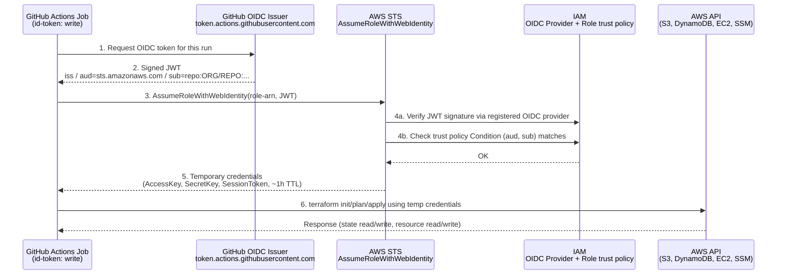
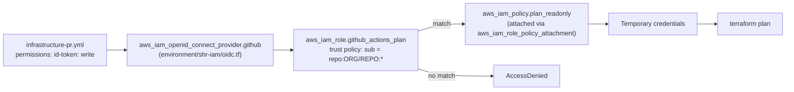

# GitHub Actions ↔ AWS OIDC Flow

How `infrastructure-pr.yml` / `infrastructure-main.yml` get AWS credentials without storing any static access key/secret key — via GitHub's OIDC identity token exchanged for temporary AWS credentials through STS.

## Sequence

## Mapped to this repo (plan role)

The apply role follows the identical flow, except its trust policy `sub` condition matches `repo:ORG/REPO:environment:*` — every apply job in this repo declares a GitHub `environment:`, which changes what GitHub puts in the `sub` claim from a ref-based subject to an environment-based one.

## Does this already support both "on PR" and "on merge to main"?

Yes — both `infrastructure-pr.yml` (event `pull_request`) and `infrastructure-main.yml` (event `push` to `main`) assume the same two roles, and this already works today without needing to special-case either trigger.

Per GitHub's own rule (see Key points below), declaring `environment:` on a job overrides whatever `sub` format the triggering event would otherwise produce. Almost every job in both workflows declares `environment:` (`<tier>-plan` for plan jobs, the bare tier/customer name for apply jobs), **except** `discover-customers` and `discover-demo-envs` (present in both workflow files, used to build the customer/env matrix from SSM) — those two assume the plan role with no `environment:` at all, so they keep whatever `sub` the trigger event itself produces:

| Job | Trigger event | `sub` claim actually produced |
|---|---|---|
| `plan-shr` (in `infrastructure-pr.yml`) | `pull_request` | `repo:ORG/REPO:environment:shr-iam-plan` — **not** `...:pull_request` |
| `plan-staging-global` (in `infrastructure-main.yml`) | `push` to `main` | `repo:ORG/REPO:environment:staging-stg-admin-plan` — **not** `...:ref:refs/heads/main` |
| `apply-prod-customers` | `push` to `main` | `repo:ORG/REPO:environment:prod-<customer>` |
| `apply-tempstaging` | `pull_request` | `repo:ORG/REPO:environment:tempstaging` |
| `discover-customers` (in `infrastructure-pr.yml`) | `pull_request` | `repo:ORG/REPO:pull_request` — no `environment:` declared |
| `discover-customers` (in `infrastructure-main.yml`) | `push` to `main` | `repo:ORG/REPO:ref:refs/heads/main` — no `environment:` declared |
| `discover-demo-envs` (both workflows) | same as above per file | same as `discover-customers` above |

So both sub *families* genuinely occur in this pipeline: environment-scoped subs for every plan/apply job that declares `environment:`, and the plain `pull_request` / `ref:refs/heads/main` subs for the two `discover-*` jobs that don't. A trust policy written as a `StringLike` list of exactly `pull_request` + `ref:refs/heads/<branch>` (the pattern that's enough for a plain repo without GitHub Environments) would work for `discover-*` but **block every environment-scoped job** — the opposite problem also applies.

That's why the two roles here are wildcarded the way they are instead:

- **Plan role** (`github_actions_plan`, read-only) — `sub` condition is the broad `repo:ORG/REPO:*`. This has to match *any* sub format, because it's genuinely assumed with all three shapes: `environment:*-plan` (the matrix plan jobs), `pull_request`, and `ref:refs/heads/main` (the two `discover-*` jobs, on PR and on main respectively). The blanket wildcard is acceptable here specifically because the attached policy is read-only.
- **Apply role** (`github_actions_apply`, read-write) — `sub` condition is narrowed to `repo:ORG/REPO:environment:*`, since *every* apply job (PR-time `apply-tempstaging` included, and every post-merge `apply-*` job) always declares `environment:` — there's no apply-side equivalent of `discover-*` that skips it. This is tighter than the plan role on purpose, since this role can create/modify real infrastructure.

Net effect: no change is needed to run plan/apply on both PR and merge-to-main — that's already the current behavior of `environment/shr-iam/oidc.tf`. Narrowing the plan role's condition to `repo:ORG/REPO:environment:*` is **not** a safe hardening as things stand — it would immediately break `discover-customers` and `discover-demo-envs` in both workflows, since neither declares `environment:`. Doing that safely would mean adding `environment: shr-iam-plan` (or similar) to those two jobs first, then narrowing the trust policy — not the other way around.

## Key points

- **No long-lived secrets.** Nothing but a `role-arn` is stored in GitHub — no `AWS_ACCESS_KEY_ID`/`AWS_SECRET_ACCESS_KEY` secret exists for either role.
- **`permissions: id-token: write` is what makes step 1 possible.** Without it, GitHub never issues a token and `aws-actions/configure-aws-credentials` fails immediately.
- **The trust policy's `Condition` is the actual access control**, not the OIDC provider itself — the provider only proves the token is genuinely from GitHub; the `sub`/`aud` match is what decides *which* repo/branch/environment is allowed to assume *that* role.
- **`sub` format depends on how the job is triggered:**
  - push to a branch → `repo:ORG/REPO:ref:refs/heads/<branch>`
  - `pull_request` event → `repo:ORG/REPO:pull_request`
  - job declares `environment:` → `repo:ORG/REPO:environment:<name>` (overrides the two above)
- Credentials returned by STS are temporary (default ~1 hour) and scoped to exactly the IAM policy attached to the assumed role.
- **One role per job, no re-assuming mid-run.** Each job calls `configure-aws-credentials` exactly once — `discover-customers`/`discover-demo-envs`/every `plan-*` job assumes `github_actions_plan`, every `apply-*`/`destroy-*` job assumes `github_actions_apply`, but never both in the same job. Nothing in that job's steps can pivot to a *different* role afterward: both `plan_readonly` and `apply_readwrite` (the policies attached in `main.tf`) carry an explicit `DenyRoleChaining` statement (`Deny` on `sts:AssumeRole`, resource `*`) — an explicit Deny always wins AWS's policy evaluation, so even if some other policy were attached to either role later that granted `sts:AssumeRole`, chaining into a different role would still be blocked. Going from plan to apply always means a *separate* job with its own OIDC exchange, gated by its own GitHub Environment (e.g. `tempstaging-plan` → `tempstaging`) — never a role switch inside one running job.
